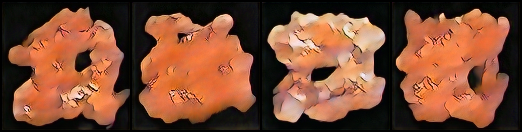
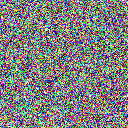
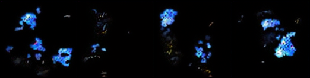
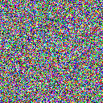
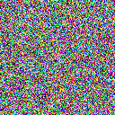

# A pokemon images generator build from scratch in pytorch implementing DDPM

## Unconditional generation
Current results for ~1750 Epoch on 1200 images with the unconditional DDPM 

> On cosine scheduler

  
  

___

## Conditional generation with free guidance
Current results for ~345 Epoch on 5883 images with the conditionnal DDPM (conditionnal encoding of dimension 42) 

>weight : [model on google drive](https://drive.google.com/file/d/131QypAm5bKnQFkletqcY4LHWCdWo8TLS/view?usp=sharing)

> On cosine scheduler
> cond : color="red", is_sprite=False

  
  

> cond : color="blue", is_sprite=True

  
  

> cond : no condition

  
  

